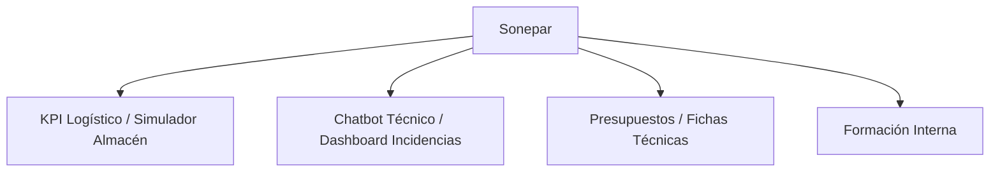

# ⚡ Proyectos Sonepar: Ecosistema de Automatización Industrial

> **Digitalización y optimización inteligente para la cadena de suministro y logística.**

Este repositorio centraliza múltiples soluciones de software diseñadas para Sonepar, cubriendo desde la gestión de incidencias hasta la simulación avanzada de almacenes y formación interna.

---

## 🏗️ Módulos Principales

## 🚀 Futuras Mejoras & Sugerencias de IA
1.  **Dashboard Predictivo**: Integrar modelos de IA que analicen los KPIs logísticos para predecir cuellos de botella en el almacén.
2.  **Asistente de Fichas Técnicas**: Usar `prompt-engineer-pro` para automatizar la extracción de datos técnicos de PDFs de proveedores.
3.  **Monitorización de Incidencias**: Activar `incident-responder` para alertar automáticamente al equipo ante fallos críticos en el simulador o el dashboard.

---

© 2024 **iagorobo24-hub** | *Powering the Sonepar digital transformation.*
